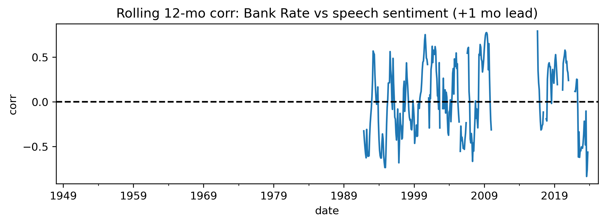

# Bank-of-England Speech-Sentiment Analysis

**Goal**  
Quantify how the tone of BoE speeches relates to UK macro indicators
(Bank Rate, inflation, equities) and test whether sentiment helps
predict future policy moves.

**Data pipeline**

| Source | Details |
|--------|---------|
| BoE Database | Official Bank Rate, 7-day OIS |
| ONS | CPI YoY, GDP level, Unemployment %, Weekly-earnings YoY |
| Yahoo Finance | FTSE All-Share monthly close |
| Project | 1 700+ BoE speeches (1990-present) + Loughran-McDonald lexicon |

**Key findings**

* Sentiment leads Bank Rate by **1 month** (ρ ≈ 0.41).
* OLS with CPI & GDP controls: +1 sentiment point → **+5 bp** next-month
  Bank Rate (*p* < 0.001, R² = 0.14).
* Rolling correlations show strongest links around tightening cycles.

  

---

*Notebook & processed panel in `/notebooks` and `/data/processed`.  
Future work: ARIMAX forecast, dashboard, lexicon refinement.*
